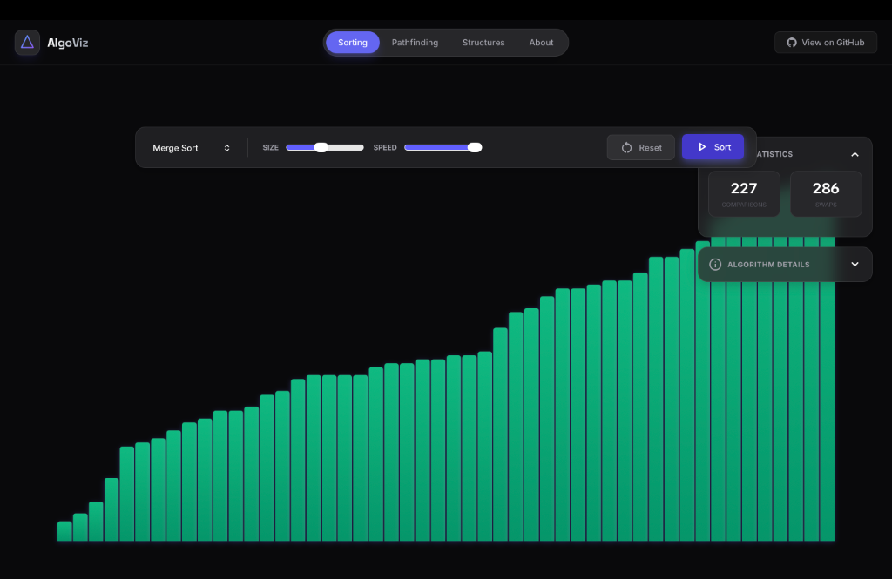
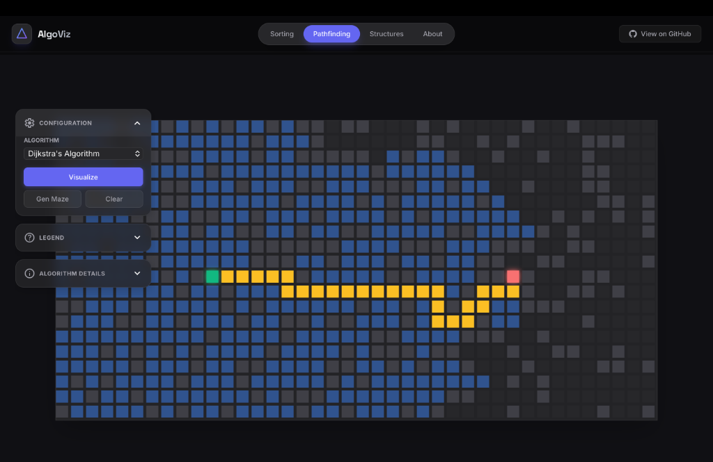
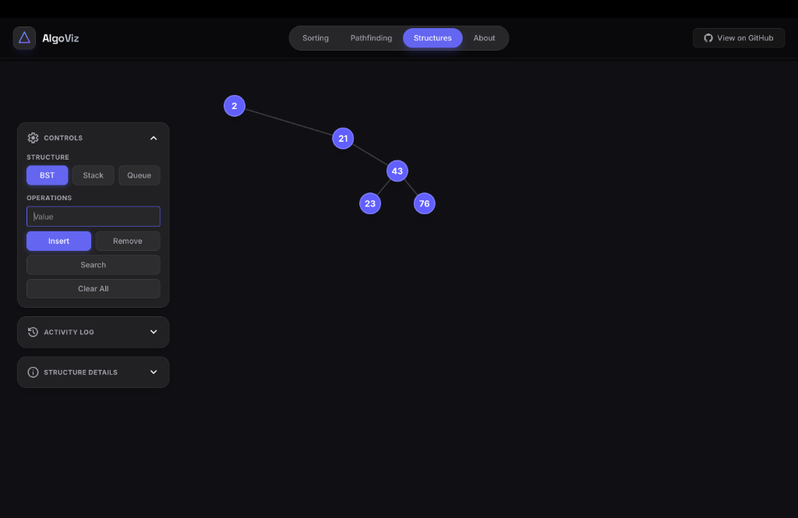

<picture>
  <source media="(prefers-color-scheme: dark)" srcset="public/assets/logo/algoviz.svg">
  <source media="(prefers-color-scheme: light)" srcset="public/assets/logo/algoviz.svg">
  
</picture>

# AlgoViz

> **See the algorithm think.**

AlgoViz is an interactive, visual-first platform for learning data structures and algorithms through real-time visualizations and step-by-step execution.

[](https://algovizvps.vercel.app)
[](LICENSE)
[](CONTRIBUTING.md)

---

## ✨ Why AlgoViz?

Most algorithm resources bury you in theory before you ever see the algorithm run. AlgoViz flips this:

- **Watch algorithms execute** — not just their output
- **Understand *why* they work** — through observable behavior
- **Minimal UI, maximum signal** — no distractions, just logic unfolding

---

## 🎬 Demo

<!-- Replace these with actual screenshots/GIFs -->
| Sorting Visualizer | Pathfinding | Data Structures |
|:------------------:|:-----------:|:---------------:|
|  |  |  |

**[🔗 Try the Live Demo →](https://algovizvps.vercel.app)**

---

## 🧮 Supported Algorithms

### Sorting
Visualize comparisons, swaps, and step-by-step progression:
- **Bubble Sort** — Simple swapping, great for understanding basics
- **Selection Sort** — Find minimum, place it, repeat
- **Insertion Sort** — Build sorted portion one element at a time
- **Merge Sort** — Divide, conquer, merge (with visual recursion)
- **Quick Sort** — Pivot partitioning in action
- **Heap Sort** — Heap construction and extraction

### Pathfinding
Draw walls, move start/end nodes, and watch exploration unfold:
- **Dijkstra's Algorithm** — Guaranteed shortest path
- **A\* Search** — Heuristic-guided pathfinding
- **Breadth-First Search (BFS)** — Level-by-level exploration
- **Depth-First Search (DFS)** — Deep dive before backtracking

### Data Structures
Interactive insert, remove, and search operations:
- **Binary Search Tree (BST)** — Visualized node positioning
- **Stack** — LIFO operations
- **Queue** — FIFO operations

---

## 🎯 Design Philosophy

AlgoViz is intentionally restrained:

| Principle | What it means |
|-----------|---------------|
| **See the algorithm think** | Every step is visible — no magic jumps |
| **Interaction over memorization** | Learn by doing, not reading |
| **Minimal UI, high signal** | Clean interface, zero distractions |
| **Progressive complexity** | Start simple, go deeper |
| **Beginner-friendly, not dumbed down** | Accessible without oversimplifying |

---

## 🛠️ Tech Stack

| Technology | Purpose |
|------------|---------|
| [Next.js 15](https://nextjs.org/) | React framework with App Router |
| [React 19](https://react.dev/) | UI components |
| [TypeScript](https://www.typescriptlang.org/) | Type safety |
| [Tailwind CSS 4](https://tailwindcss.com/) | Utility-first styling |

Algorithms are **separated from UI logic** in `/lib/algorithms/` for clarity and reuse.

---

## 🚀 Quick Start

```bash
# Clone the repository
git clone https://github.com/Veerpratapsingh08/AlgoViz.git
cd AlgoViz

# Install dependencies
npm install

# Start development server
npm run dev
```

Open [http://localhost:3000](http://localhost:3000) in your browser.

---

## 📁 Project Structure

```
AlgoViz/
├── app/                    # Next.js App Router pages
│   ├── sorting/            # Sorting visualizer page
│   ├── pathfinding/        # Pathfinding visualizer page
│   ├── datastructures/     # Data structures page
│   ├── page.tsx            # Landing page
│   └── globals.css         # Global styles
├── components/             # React components
│   ├── SortingVisualizer.tsx
│   ├── PathfindingVisualizer.tsx
│   ├── DataStructureVisualizer.tsx
│   └── ...
├── lib/
│   └── algorithms/         # Algorithm implementations (pure logic)
│       ├── sorting.ts      # Sorting algorithms
│       ├── pathfinding.ts  # Pathfinding algorithms
│       └── datastructures.ts # Data structure utilities
└── public/                 # Static assets
```

---

## 🚧 Non-Goals

AlgoViz intentionally does **NOT** try to be:

- ❌ A comprehensive DSA textbook
- ❌ A coding interview prep platform (LeetCode, etc.)
- ❌ A competitive programming judge
- ❌ A feature-heavy IDE or code editor
- ❌ A gamified learning app with streaks and badges

**Focus is everything.** We do one thing well: visualize algorithms clearly.

---

## 🗺️ Roadmap

### v1.1 — Coming Soon
- [ ] Speed control presets (slow-motion, real-time)
- [ ] Step-by-step controls (pause, step forward/back)
- [ ] Algorithm comparison mode (side-by-side)

### v1.2 — Near Future
- [ ] Linked List visualization
- [ ] Graph algorithms (DFS/BFS on graphs)
- [ ] Mobile-responsive improvements

### v2.0 — Future Vision
- [ ] Code export (Python, Java, C++)
- [ ] Custom algorithm builder
- [ ] Dark/light theme toggle

---

## 🤝 Contributing

We welcome contributions from everyone! Whether you're:
- A student learning DSA
- A developer brushing up on fundamentals
- An educator building teaching tools

**Check out [CONTRIBUTING.md](CONTRIBUTING.md) to get started.**

Good first issues are tagged with [`good first issue`](https://github.com/Veerpratapsingh08/AlgoViz/labels/good%20first%20issue).

---

## 📜 License

[MIT License](LICENSE) — free to use, modify, and distribute.

---

## 🙏 Acknowledgments

Built by [**Veer Pratap Singh**](https://veerpratapsingh.vercel.app)

Inspired by the belief that **everyone deserves to understand how algorithms work** — not through walls of text, but through the algorithms themselves.

---

<p align="center">
  <sub>If AlgoViz helps you learn, consider giving it a ⭐</sub>
</p>
